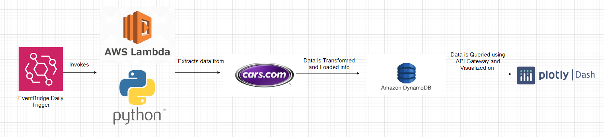

# Car Watch!

Car Watch is currently live!: http://carwatch-env.eba-jc2n7srx.us-east-1.elasticbeanstalk.com/

Car Watch allows you to monitor the new listings on cars.com using DynamoDB, Python, Lambda, and EventBridge.



## Pulling Down the Car Listings
The code found in the **extracting_and_loading_data** folder will allow you to first scrape all the car listing data. Run this command to install the dependencies.

```
pip install -r requirements.txt
```


## **Setting up DynamoDB and secret.py file**

On AWS, set up a DynamoDB instance, make sure you keep track of the table name.

## **Extracting the data**

Run 

```
python extract_car_listings.py
```

to scrape all of the data off of cars.com. Make to create a folder called "data" before running this script. 

## **Transforming and Loading the data**

Running the python notebook **batch_upload_to_dynamo.ipynb** will upload all of the csv files created to your Dynamo DB instance.


## **Updating the database with new listings with Lambda**

To make it so that your scraper runs every day and can fetch the latest car listings. Lambda is a useful tool to schedule CRON jobs. To learn how to install layers and dependencies on lambda, follow: https://docs.aws.amazon.com/lambda/latest/dg/python-package.html

- **pull_new_daily_listings.py** : this code will scrape for new listings and populate the DB accordingly
- **extract_car_listings.py** : this code allows you to set up an API gateway for external usage. Such as deploying to a dashboard or sharing with other users.