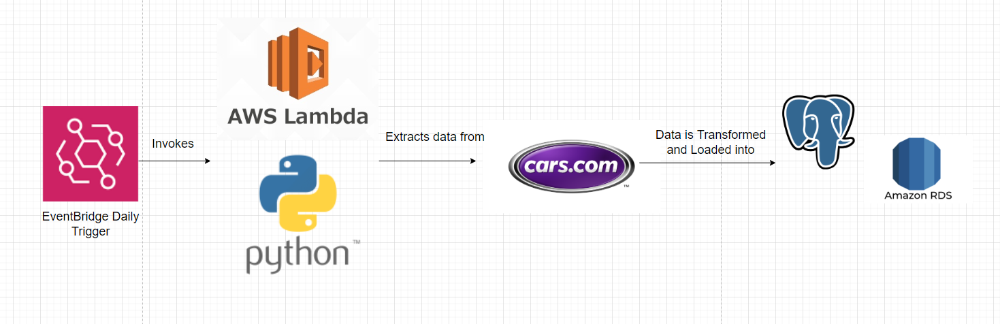

# Car Watch!

Car Watch allows you to monitor the new listings on cars.com using RDS, Python, Lambda, and EventBridge.




## Installing dependencies
This code allows you to quickly scrape all available car data on cars.com. Before running this code, run 

```
pip install -r requirements.txt
```

to install all of the python dependencies.

## **Setting up PostGreSQL and secret.py file**

On AWS, set up an RDS PostGreSQL instance and add your personal IP to the VPC groups. Then set your environment
variables to the appropriate fields listed in the secret.py file.


## **Extracting the data**

Run 

```
python async_scraper.py
```

to scrape all of the data off of cars.com. Make to create a folder called "data" before running this script. 

## **Transforming and Loading the data**

Run 

```
pyton transform_load.py
```

to aggregate and clean all of the scraped data. This script will also populate your RDS instance.


## **Updating the database with new records**

To deploy **update_extract.py** on lambda. Move **update_extra.py** into its own separate folder. In the terminal, type 

```
pip install -t . bs4 requests
```

Zip together these files, and upload them to their own lambda function.

In order to get pandas and numpy uploaded to Lambda. You must download the corresponding wheel files for your current python version.
Then use the "wheel unpack" command on Linux to open the files. Then zip all of the produced folders and upload them as a layer to 
lambda.

You can also get the correct builds of psycopg2 using [this link](https://github.com/jkehler/awslambda-psycopg2)

## Deploying your own API

Similar to deploying **update_extract.py**. You can zip together the psycopg2 and get_lambda.py file and upload it to AWS lambda.
Then, set up an API Gateway to trigger tha lambda function. Pass in "make" as a parameter and a JSON response of the newest car listings will be available. 

You can test out my API here: https://ios4w4z8wc.execute-api.us-west-1.amazonaws.com/test/car_data_scraper/?make={insert the make of the car here}